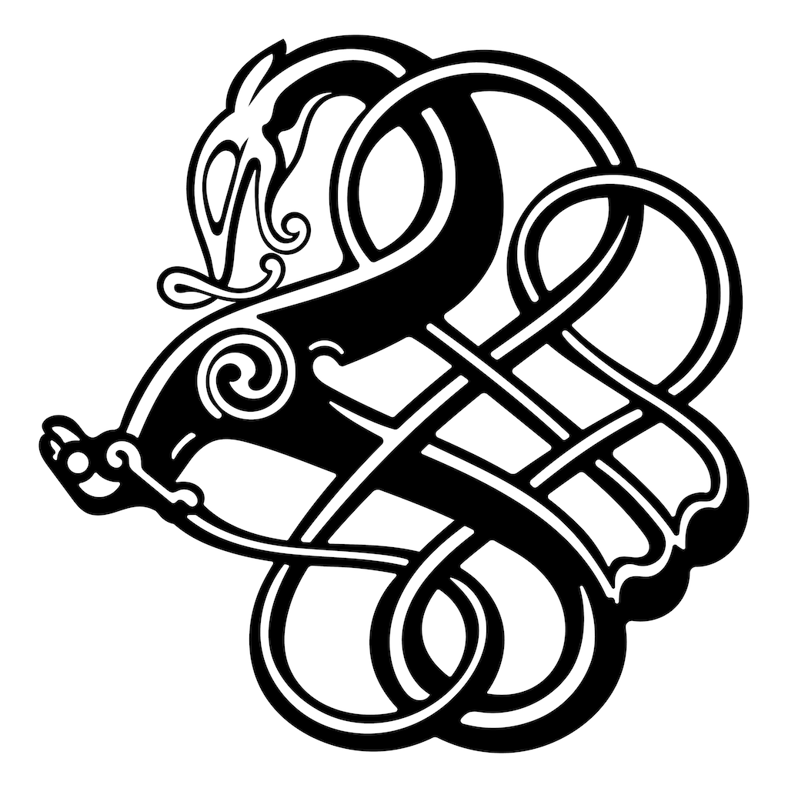

.. wyrm documentation master file, created by
   sphinx-quickstart on Tue Nov 29 21:35:30 2022.
   You can adapt this file completely to your liking, but it should at least
   contain the root `toctree` directive.

wyrm
====

Wyrm is an experimental audio and video synthesis language for real-time
music and video performance.

.. toctree::
   :maxdepth: 2
   :caption: Contents:

   developer/index

Indices and tables
==================

* :ref:`genindex`
* :ref:`modindex`
* :ref:`search`
